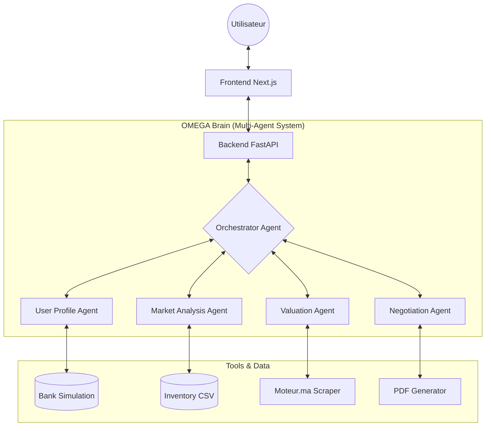

# OMEGA - L'Intelligence Artificielle au Service de la Négociation Automobile

OMEGA est une plateforme révolutionnaire qui transforme l'expérience d'achat et de reprise de véhicules grâce à un système multi-agents sophistiqué. Conçu pour les showrooms modernes, OMEGA automatise l'analyse financière, l'estimation de marché et la négociation stratégique.

## 🌟 Vision du Projet

Dans un marché automobile saturé, OMEGA apporte :
- **Transparence** : Des estimations basées sur des données réelles du marché marocain.
- **Rapidité** : Une négociation multi-tours fluide et automatisée.
- **Personnalisation** : Des offres financières adaptées au profil réel du client.

## 🏗️ Architecture du Système



## 📂 Structure du Projet

-   **/Backend**: Moteur Python (FastAPI + Multi-Agents).
-   **/frontend**: Interface utilisateur moderne (Next.js + Tailwind).
-   **/docs**: Documentation technique additionnelle (si applicable).

## 🚀 Installation Rapide

```bash
# Clone the repository
git clone https://github.com/H-LAPRIME/N-gociation-Autonome.git

# Setup Backend
cd Backend
pip install -r requirements.txt
uvicorn app.main:app --reload

# Setup Frontend
cd ../frontend
npm install
npm run dev
```

## 🏆 Hackathon Edition

Ce projet a été structuré pour une lisibilité maximale :
- **Code documenté** : Chaque agent, service et outil possède des docstrings claires.
- **Modularité** : Séparation stricte des responsabilités entre agents.
- **Esthétique Premium** : Une UI conçue pour impressionner dès le premier regard.

---
*Développé avec passion pour l'innovation automobile.*
